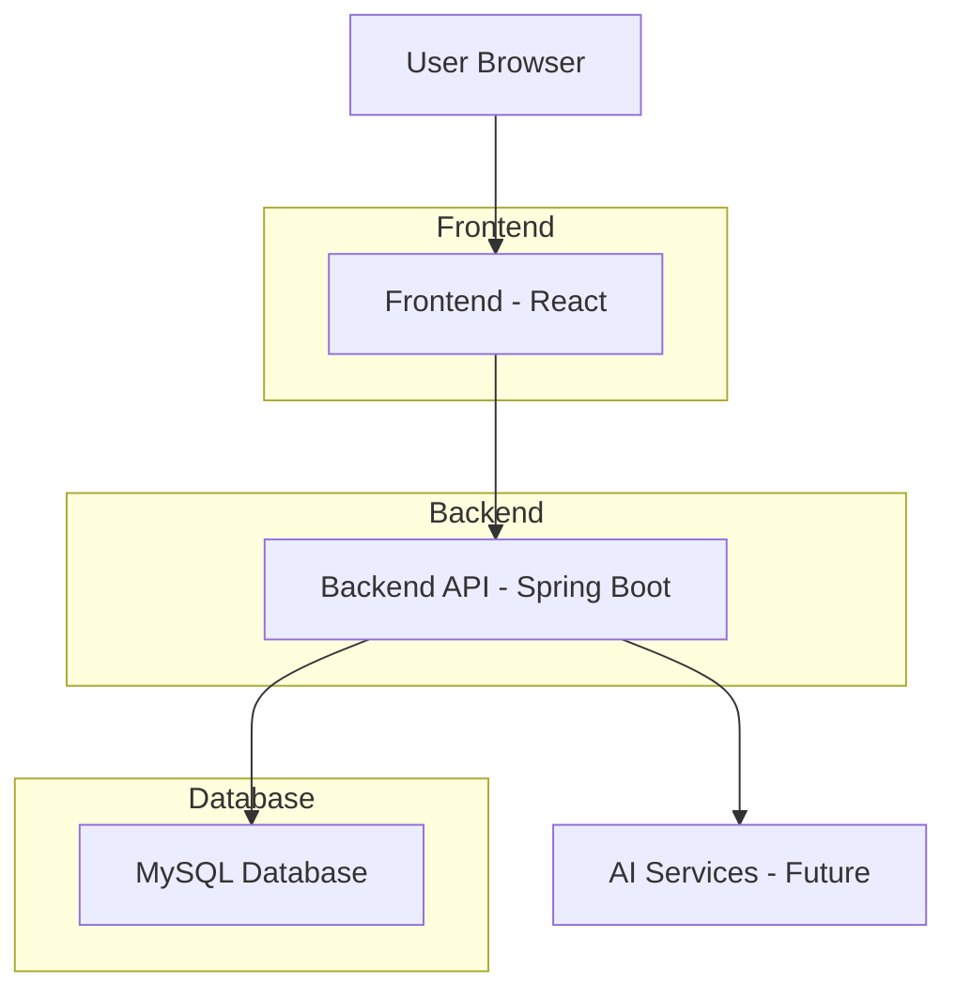
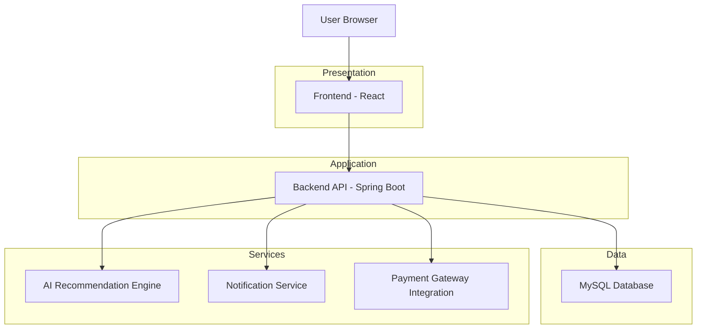
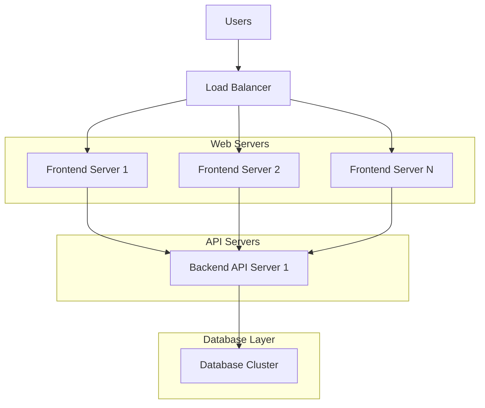

# EventMate Application Architecture

## System Architecture Diagram



## Component Overview

### 1. Frontend (React)
The frontend is responsible for:
- User interface rendering
- User interaction handling
- Form validation
- API communication with backend
- Role-based view rendering

**Key Components:**
- **LoginForm**: Handles user authentication
- **SignupForm**: Handles user registration
- **Dashboard Components**: Role-specific views (User, Planner, Admin)

### 2. Backend (Spring Boot)
The backend provides:
- RESTful API endpoints
- Business logic implementation
- Data persistence
- Authentication and authorization
- Database interaction

**Key Components:**
- **Controllers**: Handle HTTP requests
- **Services**: Implement business logic
- **Repositories**: Handle data access
- **Entities**: Represent database tables
- **DTOs**: Data Transfer Objects for API communication

### 3. Database (MySQL)
The database stores:
- User information and credentials
- Event data
- Vendor information
- Scheduling information
- Role-based access control data

## Data Flow

1. **User Registration Flow:**
   ```
   User Browser → SignupForm → UserController/signup → UserService → UserRepository → MySQL
   ```

2. **User Login Flow:**
   ```
   User Browser → LoginForm → UserController/login → UserService → UserRepository → MySQL
   ```

3. **Dashboard Access:**
   ```
   User Browser → Dashboard Component → (Role-based routing)
   ```

## Security Implementation

1. **Password Security:**
   - Passwords are hashed using BCrypt before storage
   - Secure comparison during authentication

2. **Role-Based Access:**
   - Three roles: USER, PLANNER, ADMIN
   - Default admin user created on first run
   - Only USER and PLANNER roles available during signup
   - Role verification happens at backend during login

3. **API Security:**
   - CORS configuration for frontend communication
   - Input validation using Bean Validation
   - Secure password handling

## Future Enhancements Architecture



## Technology Stack

### Frontend Technologies:
- **React**: JavaScript library for building user interfaces
- **React Router**: Declarative routing for React applications
- **Tailwind CSS**: Utility-first CSS framework
- **Framer Motion**: Animation library for React
- **Lucide React**: Icon library

### Backend Technologies:
- **Spring Boot**: Framework for building Java applications
- **Spring Data JPA**: Data access abstraction
- **Spring Security**: Authentication and authorization
- **Hibernate**: ORM framework
- **MySQL Connector**: Database driver

### Database:
- **MySQL**: Relational database management system

## Deployment Architecture



This architecture supports horizontal scaling and high availability for production deployment.